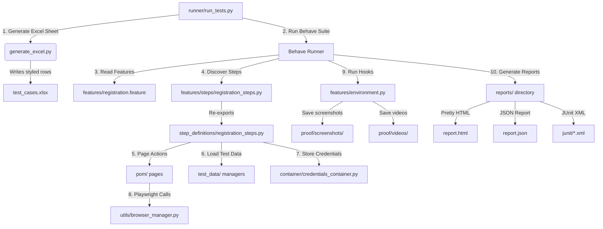

# ParaBank UI Test Automation Framework

A Python-based end-to-end UI test automation framework for the ParaBank web application, built using **Playwright**, **Behave BDD**, and the **Page Object Model (POM)** pattern. Designed to run out of the box with a single command - no manual changes required.

---

## 🎥 Execution Proof (Screenshots & Videos)
All scenarios have been executed successfully. Visual proof is committed directly to the repository:

| Test Case ID | Scenario | Screenshot Proof | Video Recording Proof |
| :--- | :--- | :---: | :---: |
| **TC_PB_01** | Successful User Registration, Sign-In, and Balance Retrieval | [📸 View Screenshot](proof/screenshots/successful_user_registration,_sign-in,_and_balance_retrieval_passed.png) | [🎥 Watch Video](proof/videos/successful_user_registration,_sign-in,_and_balance_retrieval_passed.mp4) |
| **TC_PB_02** | Failed Registration - Password Mismatch validation | [📸 View Screenshot](proof/screenshots/failed_registration_-_password_mismatch_validation_passed.png) | [🎥 Watch Video](proof/videos/failed_registration_-_password_mismatch_validation_passed.mp4) |
| **TC_PB_03** | Failed Registration - Missing Required Fields validation | [📸 View Screenshot](proof/screenshots/failed_registration_-_missing_required_fields_validation_passed.png) | [🎥 Watch Video](proof/videos/failed_registration_-_missing_required_fields_validation_passed.mp4) |
| **TC_PB_04** | Failed Sign-In - Invalid username and password credentials | [📸 View Screenshot](proof/screenshots/failed_sign-in_-_invalid_username_and_password_credentials_passed.png) | [🎥 Watch Video](proof/videos/failed_sign-in_-_invalid_username_and_password_credentials_passed.mp4) |

---

## ⚡ Quick Start: Running the Framework

### Step 1: Install Dependencies
Install the required packages and download Playwright browser binaries:
```bash
# Install Python packages
pip install -r requirements.txt

# Install Playwright browser binaries
playwright install
```

### Step 2: Choose Execution Mode
Run the tests using one of the following commands:

* **Option A: Step-by-Step (Sequential) Execution**
  Runs each scenario one after another in a single-threaded queue.
  ```bash
  python3 runner/run_tests.py
  ```

* **Option B: Parallel Execution (Recommended for Speed)**
  Launches all 4 scenarios simultaneously in separate browser instances.
  ```bash
  python3 runner/run_tests.py --parallel
  ```

> [!IMPORTANT]
> **Automatic Browser Closure**: By default, the framework is configured to automatically close the browser immediately after each scenario completes its run (for both sequential and parallel modes) and export the screenshots, videos, and HTML/JUnit reports.
>
> If you wish to keep the browser open at the end of each test for manual inspection, set `KEEP_BROWSER_OPEN=true` in your shell environment:
> ```bash
> KEEP_BROWSER_OPEN=true python3 runner/run_tests.py
> ```

---

## Architecture and Flow



---

## Directory Structure

```
ParaBank/
├── config/
│   └── global_config.py             # Environment URLs, browser settings (headless, slow_mo, timeout)
├── container/
│   └── credentials_container.py     # POJO class to store and retrieve dynamic user credentials
├── features/
│   ├── environment.py               # Before/after scenario hooks: browser setup, screenshots, videos
│   ├── registration.feature         # Gherkin BDD scenarios (TC_PB_01 to TC_PB_04)
│   └── steps/
│       └── registration_steps.py    # Behave step entry point (re-exports from step_definitions/)
├── pom/
│   ├── base_page.py                 # Base Page class with multi-selector fallback helper methods
│   ├── login_page.py                # Login panel POM: navigate, fill credentials, logout
│   ├── register_page.py             # Registration form POM: fill all fields and submit
│   └── accounts_overview_page.py    # Accounts overview POM: verify dashboard and read balance
├── proof/
│   ├── screenshots/                 # Full-page PNG screenshots (saved only on PASS)
│   └── videos/                      # WebM screen recordings (saved only on PASS)
├── reports/
│   ├── report.html                  # Formatted HTML test report
│   ├── report.json                  # Raw JSON report
│   └── junit/                       # JUnit XML output files
├── runner/
│   └── run_tests.py                 # Main orchestrator: generates Excel, preps dirs, runs Behave
├── step_definitions/
│   └── registration_steps.py        # Full step implementation logic for all scenarios
├── test_data/
│   ├── pojo_models.py               # UserRegistrationData dataclass (field definitions)
│   └── test_data_manager.py         # Generates unique dynamic test data per run
├── tests/
│   └── test_suite.py                # Python unittest suite mapped by Test Case ID
├── utils/
│   ├── browser_manager.py           # Playwright browser lifecycle: launch, context, teardown
│   └── scenario_context.py          # In-scenario state sharing container (key-value store)
├── behave.ini                       # Behave output format and capture settings
├── generate_excel.py                # Generates the styled test_cases.xlsx spreadsheet
├── requirements.txt                 # Python package dependencies
├── test_cases.md                    # Detailed Markdown test case specifications
└── test_cases.xlsx                  # Excel test case matrix (created on run)
```

---

## Key Components

### 1. `config/global_config.py`
Central configuration file. Reads settings from environment variables, falling back to sensible defaults so no manual editing is ever needed before a run.

| Setting | Default | Description |
| :--- | :--- | :--- |
| `TEST_ENV` | `QA` | Target environment. `QA` uses the JDBC-connected ParaBank URL. |
| `BROWSER` | `chromium` | Browser engine. Options: `chromium`, `firefox`, `webkit`. |
| `HEADLESS` | `false` | Show the browser window (`false`) or run invisible (`true`). |
| `SLOW_MO` | `500` | Milliseconds delay between every Playwright action for human visibility. |
| `KEEP_BROWSER_OPEN` | `true` | Pause and keep the browser open after each scenario for inspection. |
| `TIMEOUT` | `30000` | Max wait time (ms) for elements before a step fails. |

### 2. `container/credentials_container.py`
A POJO-style container class with getter and setter methods (`set_username`, `get_username`, `set_password`, `get_password`). After the registration step dynamically creates a new user, it stores the generated username and password in this container. The login step then retrieves them via `get_username()` and `get_password()`, ensuring the credentials flow cleanly between steps without hardcoding.

### 3. `pom/base_page.py`
Every POM page inherits from `BasePage`, which provides multi-selector fallback helpers: `fill_with_fallback`, `click_with_fallback`, `get_text_with_fallback`. If a primary CSS selector fails (e.g. due to a UI change), the helper automatically tries all alternative selectors before raising an error.

### 4. `test_data/test_data_manager.py`
Generates a fully unique `UserRegistrationData` object on every run:
- **Static fields**: `FIRST_NAME`, `LAST_NAME`, `ADDRESS`, `CITY`, `STATE`, `ZIP_CODE` - kept as class-level constants, easily updated.
- **Dynamic fields**: `username` (UUID-based), `password` (UUID-based), `phone` (random 10-digit), `ssn` (random formatted) - generated fresh every run to prevent ParaBank database unique constraint violations.

### 5. `features/environment.py`
Behave lifecycle hooks that run before and after each scenario:
- `before_scenario`: starts a fresh Playwright browser context with video recording enabled.
- `after_scenario`: captures a full-page screenshot into `proof/screenshots/` and moves the video to `proof/videos/` on PASS. On FAIL, skips screenshots and deletes the temporary video to keep the output clean.

---

## Test Cases

| Test Case ID | Module | Scenario | Type | Priority |
| :--- | :--- | :--- | :--- | :--- |
| TC_PB_01 | Registration & Login | Successful User Registration, Sign-In, and Balance Retrieval | Positive | High |
| TC_PB_02 | Registration | Failed Registration - Password Mismatch validation | Negative | Medium |
| TC_PB_03 | Registration | Failed Registration - Missing Required Fields validation | Negative | High |
| TC_PB_04 | Login Panel | Failed Sign-In - Invalid username and password credentials | Negative | High |

Full specifications are in [test_cases.md](./test_cases.md) and [test_cases.xlsx](./test_cases.xlsx).

---

## Running the Tests

### Run All Tests — Sequential (Default)
```bash
python3 runner/run_tests.py
```
Runs all 4 scenarios one after another in a single browser session per scenario.

---

### Run All Tests — Parallel (Recommended for Speed)
```bash
python3 runner/run_tests.py --parallel
```
Or using the shorthand environment variable:
```bash
PARALLEL=true python3 runner/run_tests.py
```

This launches **all 4 scenarios simultaneously** in separate browser processes using Python's `concurrent.futures.ThreadPoolExecutor`. Each scenario gets its own isolated Playwright browser instance and writes to its own independent report file — so there are no conflicts or race conditions.

**Observed speedup from actual execution:**

| Mode | Total Duration | How |
| :--- | :--- | :--- |
| Sequential | ~1 min 23 sec | Scenarios run one after another |
| **Parallel** | **~30 sec** | All 4 scenarios run at the same time |

The parallel total time equals the duration of the **longest single scenario** (TC_PB_01), not the sum of all.

---

### Run a Specific Test Case by Tag
```bash
# Run only the positive registration flow (TC_PB_01)
python3 runner/run_tests.py --tags @TC_PB_01

# Run all negative registration scenarios (TC_PB_02 and TC_PB_03)
python3 runner/run_tests.py --tags @negative

# Run all login-related scenarios (TC_PB_01 and TC_PB_04)
python3 runner/run_tests.py -t @login

# Run a tag filter in parallel mode
python3 runner/run_tests.py --parallel --tags @negative
```

---

### Run via Python Unittest (By Test Case ID)
```bash
# Run the entire unittest suite (TC_PB_01 through TC_PB_04)
python3 tests/test_suite.py

# Run a single test case by its ID
python3 -m unittest discover -s tests -p "test_suite.py" -k test_TC_PB_01 -v
```

---

### Run with Custom Browser or Environment Settings
```bash
# Run headlessly in CI/CD — no browser window, no delays, browser closes immediately
HEADLESS=true SLOW_MO=0 KEEP_BROWSER_OPEN=false python3 runner/run_tests.py

# Run headlessly in parallel — fastest possible CI execution
HEADLESS=true SLOW_MO=0 KEEP_BROWSER_OPEN=false PARALLEL=true python3 runner/run_tests.py

# Run using Firefox engine
BROWSER=firefox python3 runner/run_tests.py

# Run against the PROD environment
TEST_ENV=PROD python3 runner/run_tests.py

# Run with a custom element timeout (60 seconds)
TIMEOUT=60000 python3 runner/run_tests.py
```

---

## Generated Outputs

After a **sequential** run, the following files are created automatically:

| Output | Path | Description |
| :--- | :--- | :--- |
| Excel test matrix | `test_cases.xlsx` | Styled spreadsheet with all 4 test cases |
| HTML report | `reports/report.html` | Formatted human-readable test report |
| JSON report | `reports/report.json` | Machine-readable results for CI integration |
| JUnit XML | `reports/junit/` | JUnit-compatible XML for Jenkins/GitHub Actions |
| Screenshots | `proof/screenshots/` | Full-page PNG per passed scenario |
| Video recordings | `proof/videos/` | WebM screen recording per passed scenario |

After a **parallel** run, each scenario writes its own independent report to avoid file conflicts:

| Output | Path | Description |
| :--- | :--- | :--- |
| Excel test matrix | `test_cases.xlsx` | Shared test matrix (generated once before all workers launch) |
| HTML reports | `reports/report_tc_pb_01.html` etc. | One HTML report per scenario worker |
| JSON reports | `reports/report_tc_pb_01.json` etc. | One JSON report per scenario worker |
| JUnit XML | `reports/junit_tc_pb_01/` etc. | One JUnit directory per scenario worker |
| Screenshots | `proof/screenshots/` | Full-page PNG per passed scenario (shared across workers) |
| Video recordings | `proof/videos/` | WebM screen recording per passed scenario (shared across workers) |

---

## Troubleshooting

### Tests fail with: "Failed to find element using any of the selectors"
- The ParaBank site may be slow to respond, or a UI element changed.
- Increase the timeout: `TIMEOUT=60000 python3 runner/run_tests.py`
- Check the screenshot in `proof/screenshots/` to see the page state at failure.

### Browser opens but does not load the ParaBank website
- The URL configured in `config/global_config.py` may be incorrect or the server may be temporarily down.
- Verify the target URL in `config/global_config.py` and confirm the ParaBank site is accessible in a regular browser before running the tests.

### Import errors when running directly from a subfolder
- Always run tests from the project root directory:
  ```bash
  # Correct
  python3 runner/run_tests.py

  # Incorrect (will break Python path resolution)
  cd runner && python3 run_tests.py
  ```

### Browser stays open and blocks subsequent scenarios
- This happens if you set `KEEP_BROWSER_OPEN=true` for manual inspection. Press **Enter** in the terminal to close the browser and continue.
- By default, `KEEP_BROWSER_OPEN` is set to `false`, which means the browser will close automatically.

